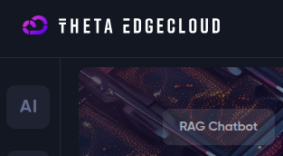
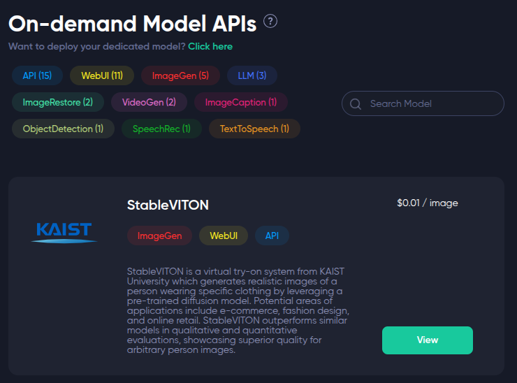
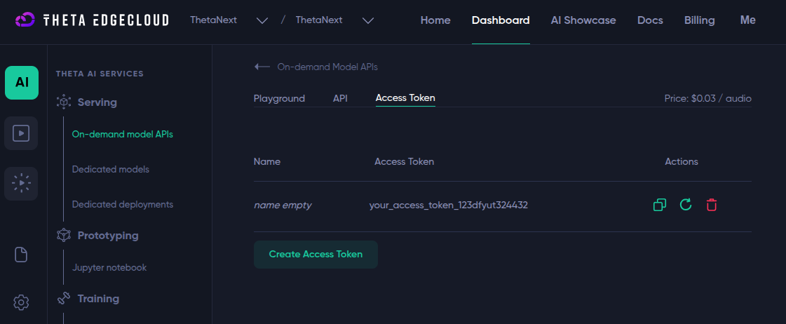

# theta-edgecloud-text-to-speech

## Access Token Setup

To use the code, you need to create an account first on [https://www.thetaedgecloud.com/](https://www.thetaedgecloud.com/).

#### After creating the account, go to 'AI' > 'On-demand models APIs'.



#### Select one of the models and click on 'View'.



Then go to the 'Access Token' tab and copy your Access Token.



#### Paste the Access Token into your `.env` file as follows:

```
IMAGE_ACCESS_TOKEN=your_access_token_here
```

## Clone the repository

```bash
git clone https://github.com/thetanext/theta-edgecloud-text-to-speech.git
cd theta-edgecloud-text-to-speech
```

## Install dependencies

```bash
npm install
```

## Run the project

### Development (auto-reload with TypeScript)

```bash
npm run watch
```

### Run once

```bash
npm start
```
